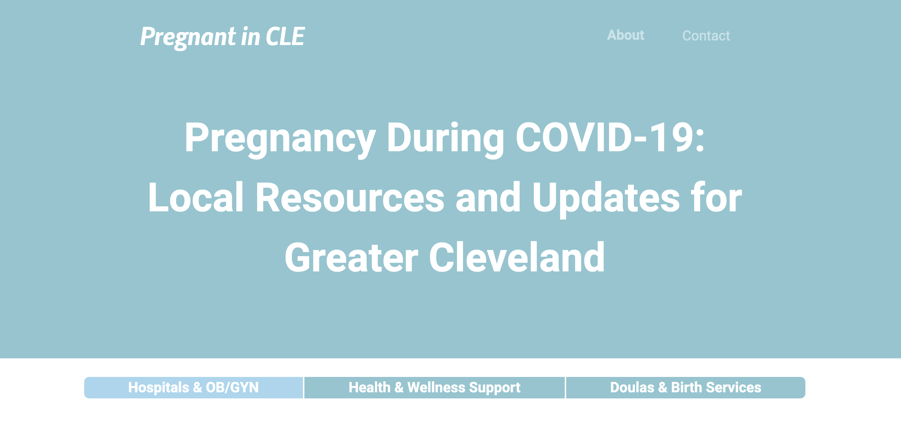

# Pregnant In CLE

This is an update page that I constructed in response to COVID-19 for pregnant women in the greater Cleveland area to provide information regarding in-person and virtual visits, restrictions, and extra precautions during the pandemic.

## Table of contents

- [Overview](#overview)
  - [The challenge](#the-challenge)
  - [Screenshot](#screenshot)
  - [Links](#links)
- [My process](#my-process)
  - [Built with](#built-with)
  - [What I learned](#what-i-learned)
  - [Continued development](#continued-development)
  - [Useful resources](#useful-resources)
- [Author](#author)

## Overview

### The challenge

Users should be able to:

- View the optimal layout depending on their device's screen size
- Navigate between tabs using keyboard arrows or by clicking

### Screenshot

### Links

- Site URL: [Pregnant In CLE](https://mollibeth.dev/pregnant-in-cle)

## My process

### Built with

- HTML5 markup
- CSS custom properties
- Bootstrap Grid, Flexbox, and Tabs
- [Bootstrap](https://getbootstrap.com/)

### What I learned

I created this site from scratch using design principles I learned in [The Complete 2022 Web Development Bootcamp](https://www.udemy.com/course/the-complete-web-development-bootcamp/) taught by Angelu Yu of [The App Brewery](https://appbrewery.com/). I also used this site as a challenge to practice the Bootstrap CSS framework and CSS custom properties.

### Continued development

My original vision for Pregnant In Cle was to create a searchable database of resources for pregnant women in the greater Cleveland area. If I were to complete the database, I'd like to re-build the site using React for the front-end and Node.js and MongoDB on the back-end, as well as add additional features for organizations and businesses to edit their profiles.

### Useful resources

- [Bootstrap Docs](https://getbootstrap.com/docs/5.2/layout/grid/) - Always reference the documentation.

## Author

- Website - [Mollibeth Cardwell](https://www.mollibeth.dev)
